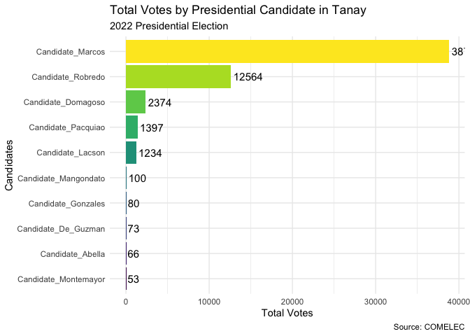
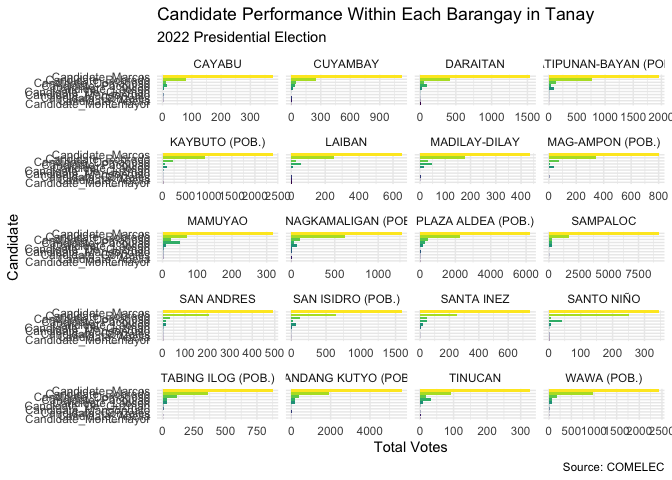

Tanay Barangay Presidential Election
================
RB Raya
2025-11-07

``` r
library(tidyverse)
```

    ## Warning: package 'ggplot2' was built under R version 4.4.1

    ## ── Attaching core tidyverse packages ──────────────────────── tidyverse 2.0.0 ──
    ## ✔ dplyr     1.1.4     ✔ readr     2.1.5
    ## ✔ forcats   1.0.0     ✔ stringr   1.5.1
    ## ✔ ggplot2   4.0.0     ✔ tibble    3.2.1
    ## ✔ lubridate 1.9.3     ✔ tidyr     1.3.1
    ## ✔ purrr     1.0.2     
    ## ── Conflicts ────────────────────────────────────────── tidyverse_conflicts() ──
    ## ✖ dplyr::filter() masks stats::filter()
    ## ✖ dplyr::lag()    masks stats::lag()
    ## ℹ Use the conflicted package (<http://conflicted.r-lib.org/>) to force all conflicts to become errors

``` r
library(readxl)
library(viridis)
```

    ## Loading required package: viridisLite

## Data

``` r
pres <- read_csv("pres.csv")
```

    ## New names:
    ## Rows: 105971 Columns: 17
    ## ── Column specification
    ## ──────────────────────────────────────────────────────── Delimiter: "," chr
    ## (5): region, province, city, brgy, precinct dbl (12): ...1, total_votes,
    ## pres_1_abella, pres_2_de_guzman, pres_3_domagos...
    ## ℹ Use `spec()` to retrieve the full column specification for this data. ℹ
    ## Specify the column types or set `show_col_types = FALSE` to quiet this message.
    ## • `` -> `...1`

``` r
precint <- read_excel("precint.xlsx")
```

``` r
precint <- precint %>% mutate(precinct = PRECINCT_ID)

df <- precint %>%
  left_join(pres, by = "precinct") %>% 
  rename(
    Candidate_Abella = pres_1_abella,
    Candidate_De_Guzman = pres_2_de_guzman,
    Candidate_Domagoso = pres_3_domagoso,
    Candidate_Gonzales = pres_4_gonzales,
    Candidate_Lacson = pres_5_lacson,
    Candidate_Mangondato = pres_6_mangondato,
    Candidate_Marcos = pres_7_marcos,
    Candidate_Montemayor = pres_8_montemayor,
    Candidate_Pacquiao = pres_9_pacquiao,
    Candidate_Robredo = pres_10_robredo
  )
```

``` r
df_brgy <- df %>%
  filter(city == "TANAY") %>% 
  group_by(brgy) %>%
  summarise(
    across(starts_with("Cand"), sum, na.rm = TRUE),  
    .groups = "drop"  
  ) 
```

    ## Warning: There was 1 warning in `summarise()`.
    ## ℹ In argument: `across(starts_with("Cand"), sum, na.rm = TRUE)`.
    ## ℹ In group 1: `brgy = "CAYABU"`.
    ## Caused by warning:
    ## ! The `...` argument of `across()` is deprecated as of dplyr 1.1.0.
    ## Supply arguments directly to `.fns` through an anonymous function instead.
    ## 
    ##   # Previously
    ##   across(a:b, mean, na.rm = TRUE)
    ## 
    ##   # Now
    ##   across(a:b, \(x) mean(x, na.rm = TRUE))

``` r
df_long <- df_brgy %>%
  pivot_longer(
    cols = starts_with("Cand"),
    names_to = "candidate",
    values_to = "votes"
  ) %>%
  mutate(candidate = fct_reorder(candidate, votes))

df_total <- df_long %>%
  group_by(candidate) %>%
  summarise(total_votes = sum(votes)) %>%
  ungroup() %>%
  mutate(candidate = fct_reorder(candidate, total_votes))
```

## Plots

``` r
ggplot(df_total, aes(x = total_votes, y = candidate, fill = candidate)) +
  geom_col() +
  geom_text(aes(label = total_votes), hjust = -0.1, size = 4) +
  labs(
    title = "Total Votes by Presidential Candidate in Tanay",
    subtitle = "2022 Presidential Election",
    x = "Total Votes",
    y = "Candidates",
    caption = "Source: COMELEC"
  ) +
  theme_minimal() +
  guides(fill = "none") +
  scale_fill_viridis_d()
```

<!-- -->

``` r
ggplot(df_long, aes(y = candidate, x = votes, fill = candidate)) + 
  geom_bar(stat = "identity") + 
  labs(
    title = "Candidate Performance Within Each Barangay in Tanay",
    subtitle = "2022 Presidential Election",
    x = "Total Votes",
    y = "Candidate",
    caption = "Source: COMELEC"
  ) +
  facet_wrap(~ brgy, ncol = 4, scales = "free_x") +
  theme_minimal() +
  guides(fill = "none") +
  scale_fill_viridis_d()
```

<!-- -->
